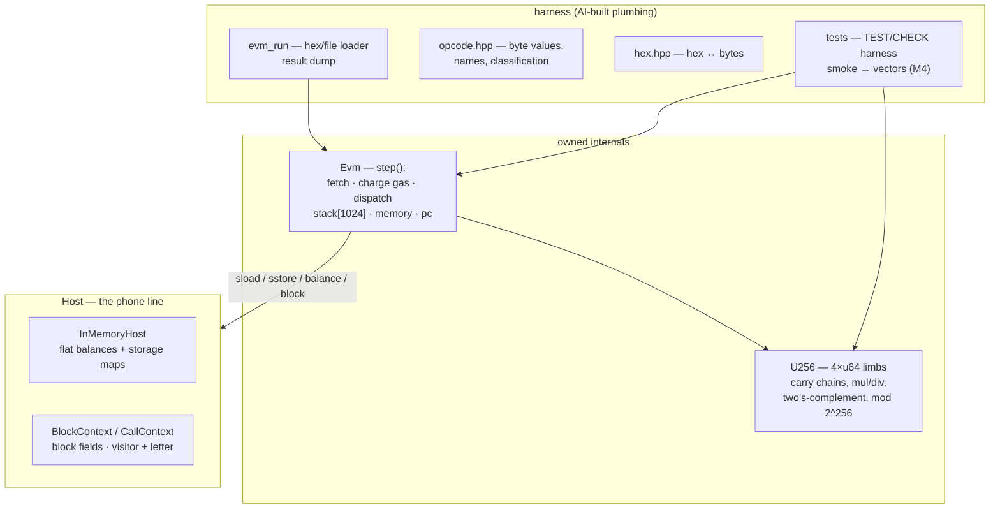

# evm — an Ethereum Virtual Machine interpreter in C++20

The execution core of Ethereum: a 256-bit stack machine, gas-metered and
deterministic. Built as a portfolio project for crypto-infrastructure
roles — same school as the limit order book, different domain.

**Scope:** execution layer only — one contract's code, stack, memory,
gas, PC, plus a flat storage world behind a `Host` interface. No CALL
family, no transactions, no state trie.

## The mental model: a country full of offices

Ethereum is a country; every contract account is an office.

- **Code on the wall** — the bytecode, read one instruction at a time.
- **The clerk** — `Evm`. `step()` fetches, charges gas, executes,
  advances `pc`. `run()` is `while (step()) {}`.
- **Stack of paper (max 1024)** — the operand stack.
- **The desk** — memory: cheap byte-addressed scratchpad, wiped between
  visits.
- **The filing cabinet** — storage: permanent, keyed by 256-bit slots,
  the priciest thing to touch.
- **A visitor with a letter** — `CallContext` + `calldata`.
- **A stamp budget** — gas: run out and everything done is shredded.
- **A phone line to the government** — `Host`: balances, other cabinets,
  block metadata. `InMemoryHost` is a toy government for tests.

## Architecture



## Build & run (Windows, MSVC)

```bat
build.bat                :: configure + build with VS-bundled CMake/Ninja
build.bat test           :: + run the test suite
build\evm_run 0x6001600101
build\evm_run code.hex
```

## Layout

```
include/evm/  types.hpp    Byte/Bytes/Gas/Address, StopReason, ExecResult
              uint256.hpp  U256 — declared; implementation is yours (M1)
              opcode.hpp   opcode constants + name table
              host.hpp     Host interface, Block/CallContext, InMemoryHost
              evm.hpp      Evm — the machine; internals are yours (M2)
              hex.hpp      hex ↔ bytes
src/          uint256.cpp (stubs throw), evm.cpp (stubs throw),
              host.cpp, opcode.cpp, hex.cpp, main.cpp
tests/        harness + smoke suite
```

## Roadmap

- [x] M0 — scaffold, harness, skeletons, smoke tests green
- [ ] M1 — `uint256`: 4×u64 arithmetic, signed variants, addmod/mulmod
- [ ] M2 — core interpreter: stack/arith/memory/flow/storage + gas
- [ ] M3 — context opcodes: calldata, block fields, SHA3, LOG
- [ ] M4 — official `ethereum/tests` vectors + perf pass + writeup
- [ ] Stretch: CALL family, wasm demo, tracer UI
